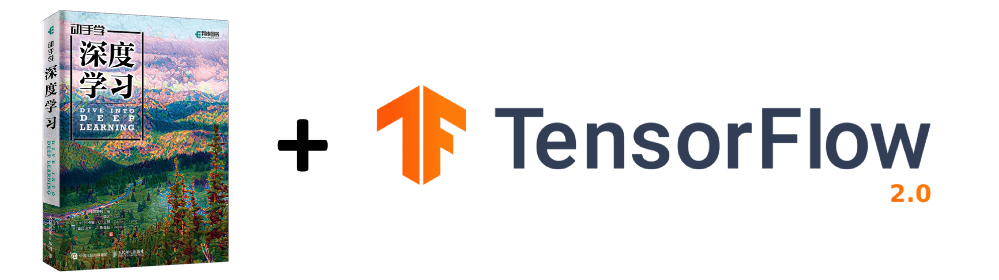

<div align=center>

</div>

[本项目](https://TrickyGo.github.io/Dive-into-DL-TensorFlow2)将[《动手学深度学习》](http://zh.d2l.ai/) 原书中MXNet代码实现改为TensorFlow2实现。经过[archersama](https://github.com/archersama)的导师咨询李沐老师，这个项目的实施已得到李沐老师的同意。原书作者：阿斯顿·张、李沐、扎卡里 C. 立顿、亚历山大 J. 斯莫拉以及其他社区贡献者，GitHub地址：https://github.com/d2l-ai/d2l-zh

此书的[中](https://zh.d2l.ai/)、[英](https://d2l.ai/)版本存在一些不同，本项目主要针对此书的中文版进行TensorFlow2重构。另外，本项目也参考了对此书中文版进行PyTorch重构的项目[Dive-into-DL-PyTorch](https://github.com/ShusenTang/Dive-into-DL-PyTorch)，在此表示感谢。

**现已更新到十章，持续更新中。。。**

## 项目已被机器之心等多家公众号[报导](https://zhuanlan.zhihu.com/p/96932594)，并且受到原作者李沐的[认可](https://github.com/TrickyGo/Dive-into-DL-TensorFlow2.0/issues/51)


## 简介
本仓库主要包含code和docs两个文件夹（外加一些数据存放在data中）。其中code文件夹就是每章相关jupyter notebook代码（基于TensorFlow2）；docs文件夹就是markdown格式的《动手学深度学习》书中的相关内容，然后利用[docsify](https://docsify.js.org/#/zh-cn/)将网页文档部署到GitHub Pages上，由于原书使用的是MXNet框架，所以docs内容可能与原书略有不同，但是整体内容是一样的。欢迎对本项目做出贡献或提出issue。

## 面向人群
本项目面向对深度学习感兴趣，尤其是想使用TensorFlow2进行深度学习的童鞋。本项目并不要求你有任何深度学习或者机器学习的背景知识，你只需了解基础的数学和编程，如基础的线性代数、微分和概率，以及基础的Python编程。

## 食用方法 
### 方法一
本仓库包含一些latex公式，但github的markdown原生是不支持公式显示的，而docs文件夹已经利用[docsify](https://docsify.js.org/#/zh-cn/)被部署到了GitHub Pages上，所以查看文档**最简便的方法就是直接访问[本项目网页版](https://TrickyGo.github.io/Dive-into-DL-TensorFlow2.0)**。当然如果你还想跑一下运行相关代码的话还是得把本项目clone下来，然后运行code文件夹下相关代码。

### 方法二
你还可以在本地访问文档，先安装`docsify-cli`工具:
``` shell
npm i docsify-cli -g
```
然后将本项目clone到本地:
``` shell
git clone https://github.com/TrickyGo/Dive-into-DL-TensorFlow2.0
cd Dive-into-DL-TensorFlow2.0
```
然后运行一个本地服务器，这样就可以很方便的在`http://localhost:3000`实时访问文档网页渲染效果。
``` shell
docsify serve docs
```
## Contributors ✨
### 这个项目的发起人及主要贡献者如下


<!-- ALL-CONTRIBUTORS-LIST:START - Do not remove or modify this section -->
<!-- prettier-ignore-start -->
<!-- markdownlint-disable -->
<table>
  <tr>
    <td align="center"><a href="https://github.com/archersama"><br /><sub><b>archersama</b></sub></a><br /></a> </a> <a href="https://github.com/TrickyGo/Dive-into-DL-TensorFlow2.0/commits?author=archersama" title="Code">💻(leader)</a></td>
    <td align="center"><a href="https://github.com/TrickyGo"><br /><sub><b>TrickyGo</b></sub></a><br /><a href="https://github.com/TrickyGo/Dive-into-DL-TensorFlow2.0/commits?author=TrickyGo" title="Code">💻</a></td>
    <td align="center"><a href="https://swordfaith.github.io/"><br /><sub><b>SwordFaith</b></sub></a><br /><a href="https://github.com/TrickyGo/Dive-into-DL-TensorFlow2.0/commits?author=SwordFaith" title="Code">💻</a></td>
    <td align="center"><a href="https://github.com/ShusenTang"><br /><sub><b>ShusenTang</b></sub></a><br /><a href="https://github.com/TrickyGo/Dive-into-DL-TensorFlow2.0/commits?author=ShusenTang" title="Code">💻</a></td>
     <td align="center"><a href="https://github.com/LIANGQINGYUAN"><br /><sub><b>LIANGQINGYUAN</b></sub></a><br /><a href="https://github.com/TrickyGo/Dive-into-DL-TensorFlow2.0/commits?author=LIANGQINGYUAN" title="Code">💻</a></td>
  </tr>
</table>

<!-- markdownlint-enable -->
<!-- prettier-ignore-end -->
<!-- ALL-CONTRIBUTORS-LIST:END -->

## 目录
* [简介]()
* [阅读指南](read_guide.md)
* [1. 深度学习简介](chapter01_DL-intro/deep-learning-intro.md)
* 2\. 预备知识
   * [2.1 环境配置](chapter02_prerequisite/2.1_install.md)
   * [2.2 数据操作](chapter02_prerequisite/2.2_tensor.md)
   * [2.3 自动求梯度](chapter02_prerequisite/2.3_autograd.md)
   * [2.4 查阅文档](chapter02_prerequisite/2.4_document.md)
* 3\. 深度学习基础
   * [3.1 线性回归](chapter03_DL-basics/3.1_linear-regression.md)
   * [3.2 线性回归的从零开始实现](chapter03_DL-basics/3.2_linear-regression-scratch.md)
   * [3.3 线性回归的简洁实现](chapter03_DL-basics/3.3_linear-regression-tensorflow2.0.md)
   * [3.4 softmax回归](chapter03_DL-basics/3.4_softmax-regression.md)
   * [3.5 图像分类数据集（Fashion-MNIST）](chapter03_DL-basics/3.5_fashion-mnist.md)
   * [3.6 softmax回归的从零开始实现](chapter03_DL-basics/3.6_softmax-regression-scratch.md)
   * [3.7 softmax回归的简洁实现](chapter03_DL-basics/3.7_softmax-regression-tensorflow2.0.md)
   * [3.8 多层感知机](chapter03_DL-basics/3.8_mlp.md)
   * [3.9 多层感知机的从零开始实现](chapter03_DL-basics/3.9_mlp-scratch.md)
   * [3.10 多层感知机的简洁实现](chapter03_DL-basics/3.10_mlp-tensorflow2.0.md)
   * [3.11 模型选择、欠拟合和过拟合](chapter03_DL-basics/3.11_underfit-overfit.md)
   * [3.12 权重衰减](chapter03_DL-basics/3.12_weight-decay.md)
   * [3.13 丢弃法](chapter03_DL-basics/3.13_dropout.md)
   * [3.14 正向传播、反向传播和计算图](chapter03_DL-basics/3.14_backprop.md)
   * [3.15 数值稳定性和模型初始化](chapter03_DL-basics/3.15_numerical-stability-and-init.md)
   * [3.16 实战Kaggle比赛：房价预测](chapter03_DL-basics/3.16_kaggle-house-price.md)
* 4\. 深度学习计算
   * [4.1 模型构造](chapter04_DL-computation/4.1_model-construction.md)
   * [4.2 模型参数的访问、初始化和共享](chapter04_DL-computation/4.2_parameters.md)
   * [4.3 模型参数的延后初始化](chapter04_DL-computation/4.3_deferred-init.md)
   * [4.4 自定义层](chapter04_DL-computation/4.4_custom-layer.md)
   * [4.5 读取和存储](chapter04_DL-computation/4.5_read-write.md)
   * [4.6 GPU计算](chapter04_DL-computation/4.6_use-gpu.md)
* 5\. 卷积神经网络
   * [5.1 二维卷积层](chapter05_CNN/5.1_conv-layer.md)
   * [5.2 填充和步幅](chapter05_CNN/5.2_padding-and-strides.md)
   * [5.3 多输入通道和多输出通道](chapter05_CNN/5.3_channels.md)
   * [5.4 池化层](chapter05_CNN/5.4_pooling.md)
   * [5.5 卷积神经网络（LeNet）](chapter05_CNN/5.5_lenet.md)
   * [5.6 深度卷积神经网络（AlexNet）](chapter05_CNN/5.6_alexnet.md)
   * [5.7 使用重复元素的网络（VGG）](chapter05_CNN/5.7_vgg.md)
   * [5.8 网络中的网络（NiN）](chapter05_CNN/5.8_nin.md)
   * [5.9 含并行连结的网络（GoogLeNet）](chapter05_CNN/5.9_googlenet.md)
   * [5.10 批量归一化](chapter05_CNN/5.10_batch-norm.md)
   * [5.11 残差网络（ResNet）](chapter05_CNN/5.11_resnet.md)
   * [5.12 稠密连接网络（DenseNet）](chapter05_CNN/5.12_densenet.md)
* 6\. 循环神经网络
   * [6.1 语言模型](chapter06_RNN/6.1_lang-model.md)
   * [6.2 循环神经网络](chapter06_RNN/6.2_rnn.md)
   * [6.3 语言模型数据集（周杰伦专辑歌词）](chapter06_RNN/6.3_lang-model-dataset.md)
   * [6.4 循环神经网络的从零开始实现](chapter06_RNN/6.4_rnn-scratch.md)
   * [6.5 循环神经网络的简洁实现](https://github.com/TrickyGo/Dive-into-DL-TensorFlow2.0/blob/master/docs/chapter06_RNN/6.5_rnn-keras.md)
   * [6.6 通过时间反向传播](chapter06_RNN/6.6_bptt.md)
   * [6.7 门控循环单元（GRU）](chapter06_RNN/6.7_gru.md)
   * [6.8 长短期记忆（LSTM）](chapter06_RNN/6.8_lstm.md)
   * [6.9 深度循环神经网络](chapter06_RNN/6.9_deep-rnn.md)
   * [6.10 双向循环神经网络](chapter06_RNN/6.10_bi-rnn.md)
* 7\. 优化算法
   * [7.1 优化与深度学习](chapter07_optimization/7.1_optimization-intro.md)
   * [7.2 梯度下降和随机梯度下降](chapter07_optimization/7.2_gd-sgd.md)
   * [7.3 小批量随机梯度下降](chapter07_optimization/7.3_minibatch-sgd.md)
   * [7.4 动量法](chapter07_optimization/7.4_momentum.md)
   * [7.5 AdaGrad算法](chapter07_optimization/7.5_adagrad.md)
   * [7.6 RMSProp算法](chapter07_optimization/7.6_rmsprop.md)
   * [7.7 AdaDelta算法](chapter07_optimization/7.7_adadelta.md)
   * [7.8 Adam算法](chapter07_optimization/7.8_adam.md)
* 8\. 计算性能
   * [8.1 命令式和符号式混合编程](chapter08_computational-performance/8.1_hybridize.md)
   * [8.2 异步计算](chapter08_computational-performance/8.2_async-computation.md)
   * [8.3 自动并行计算](chapter08_computational-performance/8.3_auto-parallelism.md)
   * [8.4 多GPU计算](chapter08_computational-performance/8.4_multiple-gpus.md)
* 9\. 计算机视觉
   * [9.1 图像增广](chapter09_computer-vision/9.1_image-augmentation.md)
   * [9.2 微调](chapter09_computer-vision/9.2_fine-tuning.md)
   * [9.3 目标检测和边界框](chapter09_computer-vision/9.3_bounding-box.md)
   * [9.4 锚框](chapter09_computer-vision/9.4_anchor.md)
   * [9.5 多尺度目标检测](chapter09_computer-vision/9.5_multiscale-object-detection.md)
   * [9.6 目标检测数据集（皮卡丘）](chapter09_computer-vision/9.6_object-detection-dataset.md)
   * [9.8 区域卷积神经网络（R-CNN）系列](https://github.com/TrickyGo/Dive-into-DL-TensorFlow2.0/blob/master/docs/chapter09_computer-vision/9.8_rcnn.md)
   * [9.9 语义分割和数据集](https://github.com/TrickyGo/Dive-into-DL-TensorFlow2.0/blob/master/docs/chapter09_computer-vision/9.9_semantic-segmentation-and-dataset.md)
   * [9.10 全卷积网络（FCN）](https://github.com/TrickyGo/Dive-into-DL-TensorFlow2.0/blob/master/docs/chapter09_computer-vision/9_10_fcn.md)
   * [9.11 样式迁移](https://github.com/TrickyGo/Dive-into-DL-TensorFlow2.0/blob/master/docs/chapter09_computer-vision/9_11_neural_style.md)
   * [9.12 实战Kaggle比赛：图像分类（CIFAR-10）](https://github.com/TrickyGo/Dive-into-DL-TensorFlow2.0/blob/master/docs/chapter09_computer-vision/9_12_kaggle_cifar10.md)
   * [9.13 实战Kaggle比赛：狗的品种识别（ImageNet Dogs)](https://github.com/TrickyGo/Dive-into-DL-TensorFlow2.0/blob/master/docs/chapter09_computer-vision/9_13_kaggle_dog.md)
* 10\. 自然语言处理
   * [10.1 词嵌入（word2vec）](chapter10_natural-language-processing/10.1_word2vec.md)
   * [10.2 近似训练](chapter10_natural-language-processing/10.2_approx-training.md)
   * [10.3 word2vec的实现](chapter10_natural-language-processing/10.3_word2vec-tensorflow2.md)
   * [10.4 子词嵌入（fastText）](chapter10_natural-language-processing/10.4_fasttext.md)
   * [10.5 全局向量的词嵌入（GloVe）](chapter10_natural-language-processing/10.5_glove.md)
   * [10.6 求近义词和类比词](chapter10_natural-language-processing/10.6_similarity-analogy.md)
   * [10.7 文本情感分类：使用循环神经网络](chapter10_natural-language-processing/10.7_sentiment-analysis-rnn.md)
   * [10.8 文本情感分类：使用卷积神经网络（textCNN）](chapter10_natural-language-processing/10.8_sentiment-analysis-cnn.md)
   * [10.9 编码器—解码器（seq2seq）](chapter10_natural-language-processing/10.9_seq2seq.md)
   * [10.10 束搜索](chapter10_natural-language-processing/10.10_beam-search.md)
   * [10.11 注意力机制](chapter10_natural-language-processing/10.11_attention.md)
   * [10.12 机器翻译](chapter10_natural-language-processing/10.12_machine-translation.md)
* 11\. 附录
   * [11.1 主要符号一览](chapter11_appendix/11.1_notation.md)
   * [11.2 数学基础](chapter11_appendix/11.2_math.md)
   * [11.3 使用Jupyter记事本](chapter11_appendix/11.3_jupyter.md)
   * [11.4 使用AWS运行代码](chapter11_appendix/11.4_aws.md)
   * [11.5 GPU购买指南](chapter11_appendix/11.5_buy-gpu.md)

持续更新中......


## 原书地址
中文版：[动手学深度学习](https://zh.d2l.ai/) | [Github仓库](https://github.com/d2l-ai/d2l-zh)       
English Version: [Dive into Deep Learning](https://d2l.ai/) | [Github Repo](https://github.com/d2l-ai/d2l-en)


## 引用
如果您在研究中使用了这个项目请引用原书:
```
@book{zhang2019dive,
    title={Dive into Deep Learning},
    author={Aston Zhang and Zachary C. Lipton and Mu Li and Alexander J. Smola},
    note={\url{http://www.d2l.ai}},
    year={2019}
}
```
