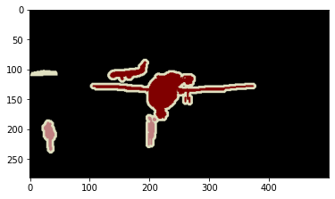
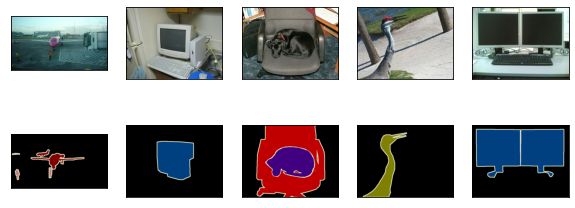
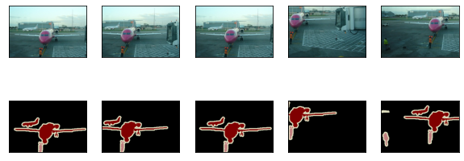

```python
def show_images(imgs, num_rows, num_cols, scale=2):
    figsize = (num_cols * scale, num_rows * scale)
    _, axes = plt.subplots(num_rows, num_cols, figsize=figsize)
    for i in range(num_rows):
        for j in range(num_cols):
            axes[i][j].imshow(imgs[i * num_cols + j])
            axes[i][j].axes.get_xaxis().set_visible(False)
            axes[i][j].axes.get_yaxis().set_visible(False)
    return axes
```


```python
# Install TensorFlow
try:
  # %tensorflow_version only exists in Colab.
  %tensorflow_version 2.x
except Exception:
  pass
import tensorflow as tf
from tensorflow import keras
import numpy as np
import matplotlib.pyplot as plt
import math
%matplotlib inline
```

# 9.9 语义分割和数据集

在前几节讨论的目标检测问题中，我们一直使用方形边界框来标注和预测图像中的目标。本节将探讨语义分割（semantic segmentation）问题，它关注如何将图像分割成属于不同语义类别的区域。值得一提的是，这些语义区域的标注和预测都是像素级的。图9.10展示了语义分割中图像有关狗、猫和背景的标签。可以看到，与目标检测相比，语义分割标注的像素级的边框显然更加精细。


图9.10 语义分割中图像有关狗、猫和背景的标签

## 9.9.1 图像分割和实例分割

计算机视觉领域还有2个与语义分割相似的重要问题，即图像分割（image segmentation）和实例分割（instance segmentation）。我们在这里将它们与语义分割简单区分一下。

* 图像分割将图像分割成若干组成区域。这类问题的方法通常利用图像中像素之间的相关性。它在训练时不需要有关图像像素的标签信息，在预测时也无法保证分割出的区域具有我们希望得到的语义。以图9.10的图像为输入，图像分割可能将狗分割成两个区域：一个覆盖以黑色为主的嘴巴和眼睛，而另一个覆盖以黄色为主的其余部分身体。
* 实例分割又叫同时检测并分割（simultaneous detection and segmentation）。它研究如何识别图像中各个目标实例的像素级区域。与语义分割有所不同，实例分割不仅需要区分语义，还要区分不同的目标实例。如果图像中有两只狗，实例分割需要区分像素属于这两只狗中的哪一只。

## 9.9.2 Pascal VOC2012语义分割数据集

语义分割的一个重要数据集叫作Pascal VOC2012 [1]。为了更好地了解这个数据集，我们先导入实验所需的包或模块。


```python
import time
from tqdm import tqdm
import sys
sys.path.append("..")
```

我们先下载这个数据集的压缩包（[下载地址](http://host.robots.ox.ac.uk/pascal/VOC/voc2012/VOCtrainval_11-May-2012.tar)）。压缩包大小是2 GB左右，下载需要一定时间。下载后解压得到VOCdevkit/VOC2012文件夹，然后将其放置在data文件夹下。


```python
# 下载并解压文件到data目录
import requests
import tarfile

r = requests.get("http://host.robots.ox.ac.uk/pascal/VOC/voc2012/VOCtrainval_11-May-2012.tar")
with open("data/VOCtrainval_11-May-2012.tar", 'wb') as f:
    f.write(r.content)

def extract(tar_path, target_path):
    try:
        t = tarfile.open(tar_path)
        t.extractall(path = target_path)
        return True
    except:
        return False

extract("data/VOCtrainval_11-May-2012.tar", "data/")
```


    True


解压后包含：

![image.png](data:image/png;base64,iVBORw0KGgoAAAANSUhEUgAAARwAAAC6CAYAAAB8xvKnAAAgAElEQVR4Ae2d6a8URRfG/Vf8YMInQ2KCRo0Y931FxX2NgAbFBVTQgOCCihtxifuCghtGBRciggQ3cAFcEJVNMeBuUFQ0aL35lZ556/at7p65Pd1MzzyVzO2e7urq0091PffU6Z7n7OC6vLzzzjvuwgsvdL///nuXX6kuTwh0PgI7VG3iG2+84W644YZ+n5kzZ5ZiSiuE88UXX7ijjjrKsVQRAkKg/QhUSjhffvmlO/PMM1M/999/f9uvUITTdkjVoBAYMAKVEs6nn36aSjZZRGT78Izyyg8//OAuuOACt9NOO7mTTjrJ3XnnnX2mVF9//bXfP2jQIDdkyBD34IMPum3btrmnnnrK7bjjjo0P3ylp9fPs0H4hIAT6I1ArwoF4IK208ueff7oJEya46667zm3evNlt3LjRk4vFcH755Rd31llnuVmzZnmSYT+k9Prrr/smk1OqvPppdmi7EBACcQS6inAgjGHDhjmmblbefPPNhoeDJ/Pzzz97srH9eE0333yz/5oknLz61oaWQkAINIdAKuF8++23fjrClCTtQ51WStEpVZ6HQ7zm1FNP9d6N2ZWM4UBGTLmYUtkUyqZqScKhjaz6dg4thYAQaA6BVMLh8G+++cZdfvnl/eIubGNfq2V7E853333nhg8f7ngi9tdff3nz7YkZX5KEk1e/1etXfSHQ6whkEg7gJElnoGRDW2UTTt6Uiv14ST/99JPv93/++cfHe9I8nLz6vX7z6PqFQKsI5BIODRrpFCEb2imbcJJB4w0bNrhzzz23EcPhO+/ZzJkzx23ZssW9/PLL/kmVEQ5PuIgBMQ3bunWry6vfKtiqLwR6HYGmCAeQIJ2BTKNCgMsmHM6V91j83XffdQcddJCP4UyePNm/gDhp0iQfSCZIzGNy4jsWSM6qH16b1oWAEMhHoGnCyW8qv0YVhJNvhWoIASGwvRAQ4Wwv5HVeIdCDCFRKOHk/bbA3irOW4Ts2PdhfumQhUGsEKiUckOLHm9OnT3dTp05t6cMx77//fq3BlvFCoNcRqJxweh1wXb8Q6GUERDi93Pu6diFQMQIinIoB1+mEQC8jIMLp5d7XtQuBihEQ4VQMuE4nBHoZgR3Wr1/v9BEGugd0D1RxD4hwRLj6h6N7oLJ7QISjm62ym62K/6A6R2d7aiIcEY4IR/dAZfeACKeDb7bPPvvMnXPOOe75558vdEPcfffdbvz48dE2OMcrr7ziWMo76GzvoBv6p/aE89xzz7mrr7663+eee+4pPICuueYad95553klwLCz+dX7aaed5m666Sa3bt06/3n66afdgQce6GVLd911Vzdt2rR+g3jVqlVe8GuXXXbx9ajPcbQRtm/rVRAOPzXBjnnz5nkbIKY0cjK7tBQxDfQeqDXhIJSV9UPP22+/PTqQmwXr1Vdfdfvuu69btGhRn3YWLFjgt7OkrYcfftjtvvvuXrp0xYoVvv6JJ57oLrvsMrdmzRpfB/IYNWqUO/vss92SJUvc559/7l544QW3//77u2effbZP+2ZfFYRj57KlCEdkYvdCGctaEw7pXbIIJ28fnlEWqObJMCUJ60FkTHUghI8++sgdd9xx7oknnuhT56233vKkhKogx5LnCuGvpUuX9qmH0Je1hacDeeEh7bzzzu7KK690EFc4pXrppZfckUce6T2kY445xqe4QQoVTyy087333vP1IMVwSgUBTpw40Sshrly50pPjwQcf7ObOnesOOeSQhrA865BneN1aFxkVvQd6mnAgJEgrC0QGqxEC9Rikp5xyilcG5DuEwuBkgIftrF692o0ePdrdcccdfvu1117rLrnkkobHY3WXL1/uJU8hDcgEjwcJVDygRx55xBOPEc7ChQvd4Ycf7vC8aB9yguw++OADXze0E4Lj+iBNIxwIjXWIil/eYwPeG4RjXpw8HJGK3ZtlLEU4OYSDpwKh2PSJwc73t99+2w9YyCDNGwgHb7ge60jIAI+GuJHFdIj5kLiPc9h+PCI7HvIjLQ4EhT0QCfZaXZtSGuEwdYPQQpIV4Yhg7H6qYlkZ4fBfmCBr1oc6rVx00SlVMx6OeSo2ePFUxo0b1/BU2kU4Fq/BqzEMbBvnsHXLpRUu2W92cjzTPIjISBLCIcPoAQcc4G699dYGoXEeEY4Ix+63KpaVEQ4Xgxt/6aWX9ou7sM1c/FYuugrCwR7iMzyVIv7CFIbpitlZdEoFUUAQeDNMifIIJ9xvNtiSfUzbiMcQnGY6xT4Ih2wVBKmPPfZYeTgd/CqE9WW3LislHEBMks5AyYa2qiIcbGa6gpdzwgkneIKwGyItaAw5HXbYYT7GQ11IilhJklgtaAzhZE2pCPbiWYXeFe3aUzDWmVaR6O/iiy/2WSfMRptS8f3ee+91I0eObJCRPBx5OHafVLGsnHC4KCOdImRDO1URjsVEmMaEMRbroLTH4qQUJhhMPbyNESNG+BxZkFHssXgyaAw58LSKKRNtsH+33XZzM2bMcGvXrnWLFy/23iJxG/ZDPmDKUy5iTWZfSDjYgfdz1113+alVknAIcvP4/pNPPulDZtaWliKoIvfAdiEcDIZ0kv/tW72QqggHu1588UU/2MOBbPZCSM28+EeQl0fxvPi30047ea+JQC7H0xbLrMfi7GdaZC8Y8o5Q8sVBpn88ReNcZl9IOGzjGjiWZZJw3nzzTf84fY899vD609aGliKadtwD241w2mF8lYTTDnvVhgZtr98DIpycx+K9foPo+kWS7bwHak04eT9tyHvTmP200U5A1ZYGqO6B9Hug1oRDx/LjTXJckR+8lQ/H8Ctp3RzpN4ewETbtvgdqTzjtBkTtaZDpHijvHhDh6CUweXm6Byq7B0Q4utkqu9nkOZTnOdQFWxGOCEeEo3ugsntAhKObrbKbrS7/hWVneZ6YEuH1clYyXbsQqBgBEU7FgOt0QqCXERDh9HLv69qFQMUIiHAqBlynEwK9jIAIp5d7X9cuBCpGQISTAJw8TTfccEO/z8yZMxM1W/+K1gwCWn/++Wefg3/77TcvivXAAw+4f/75x3+QjUAwHQ0eUtCw748//uh3HNITQ4YM8fWoz3G0Qdm2bZubPXu222effRr7SVFj+1lSn2wSnIfj33333cY5OB7dHs6NUiA6PmHBHjs/chuoIlJfRQikISDCCZD58ssv+8mfhj8Avf/++4Para9+/PHHXvUPUa6wIIrFoGdJQXtnr732cvPnz3c//fSTF/FCTB09ZUiA8vvvv7uxY8c6RL6+/vprt3XrVp/v6tBDD3Vo2lAgm+OPP94LaXEcvx1DhZDrpHA+vpNxgv1khYBYNmzY4PejUsjxCIFBWvzQ1Qr1UUDk/N98840n0UcffdRrKf/8889WTUsh0AcBEU4ABwMwJJhW1/GMsop5MgzksKDgd+GFF3oSYbCaAHpYB5JAonTZsmV+M1pARxxxhNu4cWNYzaevoS3aQd8YgS8rW7Zs8fmojDgefPBB/4NXIzHsI7UN4usU2w7pHX300X0Ih/aRWw09ok2bNrmTTz7ZE6SdU0shECIgwgnQKEo4EJR5KUGzfVYhGyMXdhgJoORHgVAY3AzesPz111/uiiuucLNmzfKb77zzzj5kYXV//PFHTwLJaRv72QeZ4WlRIEhrj+9Msa677jqvv+wr/PcnRjjhflvHc4Nwkrbbfi2FgAgnuAeqIBw8FQjFiInBz/evvvrKW4L3wXcGebJYbInt4XqyXuw7ZIJ86YQJExoxJNpIeluxbc0QDt7Q5MmTfUzHYkQxO7SttxGoLeF8++23jv/yWR/qtFKqIBzzVJhGUbAfYXabvpRBOBAAHtQZZ5zhQkxi5BLblkc42E6cBwF3pmUqQiANgdoSDhdEsPLyyy/vF3dhG/taLVUQDjYRIyFVC/EXnuwQj7FSdEoFoRFf+fvvv61JH0QmmJx8ggS5FJ1SQWYIuZNoLySzxsm1IgQCBGpNOFxHknQGSja0VRXhYDMDFC8HrwOCsMJ6LGgMOfEEKQwak9wuSawEgsMYEddEriqWyZIXNLb6aR4OZMNjda4hGby2Y7UUAiECtSccLsZIpwjZ0E5VhMNAvfHGG/27L7ybw/ewpD0WD+MvTF14CkXyPAZ77LE4Hk34mDw8h11v+Ficx+Y8Bk+SWBrh8Pg95jklz6PvQsAQ6ArC4WIYJMmBYhfZ7LIqwsEecnLtueeejSdGoY3mOeS9+Pfrr7+62267zb/4x4t3eE2QgBEYU6YwB7mtmwdk57EX/zieTKLJEiMc3gOiHWszXHJeFSEQQ6BrCCd2ca1uq5JwWrVN9YVANyAgwgl6UYQTgKFVIVACAiKcANS8nzY08+ax/WwgaFarQkAI/IeACCdxK/DjzenTp/tcV+SuavbDMcRlVISAEEhHQISTjo32CAEh0GYERDhtBlTNCQEhkI6ACCcdG+0RAkKgzQiIcNoMqJoTAkIgHQERTjo22iMEhECbERDhtBlQNScEhEA6AiKcdGy0RwgIgTYjIMJpM6BqTggIgXQERDjp2GiPEBACbUZAhNNmQNVc6wisX7/e8VHpfgREOCX3cZl5rkLT+eHp0KFDK/95BcLpCIElU9+EtoXrJmsRaikjsXHVVVc51ApVuhsBEU6J/Zv3Y9Ciea5C09FGJpdVqI8c7i9rvR2EU5ZtarfzEBDhRPqkXdq8ReUumhWyQpZ0xIgRPoHe6aef3i9NC+3cd999nowGDRrkk+5ZPikIg2NQGUSIi/2kijExdES6qIsSICJbLD/44AOPGl5KKLxlXkuYkZP2xowZ43744QfvBSE6ZseYEBj2hdeKkBrqhhxL1tHHHnusITKfZy+C7kinko3Uzl1UmC1yi2jTABEQ4USAw1tox01alHCayXOF+YiwM6jJcYWHYzmu7NIYzGTOhDiQImUAo5u8efPmBglAMnzHKxs2bJh76aWX/OEoACIj+tZbbzWyc9KWKQPGPJx77rnHXXTRRV6rmfxYN998c8Pzik2pQsL55ZdfvMA8KYQhLrKAoslMihvIj/NBWmn2IpOKciHHcfy0adOi6ZUNGy2rRUCEE8Ebwimqj0yzVRAO/9FDkkEig/S75qFgBwOa//pWGLQIsq9du9YP4GTyOupDEgxwtJdD3WW28Z3tRgBhDIdtEBfEYoXUN5AYnlge4VAXMgyF5bkmSIdEftieZi/nw8siHmRpd7ISA5p9WlaHgAgngjWEg3dRlHSqIBw8EvKOm0dm0yvObQUCsekO20KvhHWuFd1iK+ZxGDlY6l/bj/dj06GwLdsP2eGhMK2x6ZMl97M2Q3vsfBzP9kmTJjUIg20kCSStMOfKspe6PO1i2scHkiXvOiSo0hkIiHAi/WCEU5R0qiAcBqgN6nAZeiXtJhzylacRDp4F3hFTKrwLSpjcbyCEgyeGR9YM4XA+bFixYoUXmCeQ/sADD/QhsEiXa1NFCIhwIkDXhXDwJM4//3w/oMPLIH3wOeec05iWDJRw8AxanVIZoUAyVsgk0ayH08yUKs0jg2g+/PDDRtpkzs90DO8o9ODMLi2rR0CEE8HcCKfTp1QkxbPYRngZBI95amUZPQdKOLRJcJgYDQFnBjTkccABBzSCxjx9Ij4DURCQ5l0aYijkGcfDITcWQVwjHEiMgC/v3kBOZAgNp1QWNCZITNCXnFsQTBg0TiMc2mYqRwzr+++/9/YSICdRH+2qbH8ERDiRPoBwipINzZY9pWLalPbeDfELC54WIRwG8ZIlS5zlyCI2AvmwnQIJcS4eQTOVokBCDHrLlcWg57hNmzb5/TxW33vvvRuB5JBwqEA8iqdu4WNxnnZR8mI4kJTFjzg/xLtu3Tp/rP5sfwREOJE+gHAsCBvZ3fSmsgmnaUNUUQh0CAIinEhHdMqLf0wdwqdNEVO1SQjUCgERTondlffTBggl70MbKkKgWxAQ4ZTck8pzVTLAar5WCIhwatVdMlYI1BsBEU69+0/WC4FaISDCqVV3yVghUG8ERDj17j9ZLwRqhYAIp1bdJWOFQL0REOHUu/9kvRCoFQIinFp1l4wVAvVGQIRT7/6T9UKgVgiIcGrVXTJWCNQbARFOvftP1guBWiEgwim5u8rMS2ViV6FcZ8mX01LziF5NmTLFDR48uCFVEUpbZDXW6deWZbv2pSMgwknHpvCevB9vFs1L1cmDEtvGjh3rxbYQ4kKcC10dMkCEaoBpIHfytaXZrO35CIhwIhh1ijwFwlRZJTkoEacix9RDDz3k8zkhYIW6HsRngljknsLLsILIOPuoi+g5YlqIallZs2aNV+xDzGrUqFE+7YrpGVMHMS3EtdBTRtkPhT8KOsSo/Nl3tiHahWgYNrHOZ968eT4fFu1jBzpEXEcsfxWSqtdff733mPCaaOfXX3/159OfeiAgwon0U10EuGKEQ7pf5DiRGWWwH3zwwe6www5r5KSaOXOmO+2003wqF2Q3yfgwa9YsTzLIeUIaJk1KBgjqggcDm/aQEzXC+eyzz/x3NJSRFiWZHilevvvuO6+nTFuQn6n1JaFetGiRb99ySCF2bm0nr41jw3xX2IZQeygWn2xf3zsPARFOpE/qIjGaHJTm4SDxScGDwAswj4Jt1LE8UngyDNzQo8GrMqlQpj4QjGVf4HjiRZAC3gYC63hEVkxL2Two9JDxfsieSbsrV670GsbUN9vDFDRIkEJYeEe2P4xP0QakxHVRSB+DaHpov9miZWciIMKJ9AuEgzBWUV3jsiVGk4MSMsHuMEMBg5SPlZBw2GbTLaZUlmbG6hu5cB4rto1zQDx2TLgMYzSQAdMuCx6TZQJC5HimXOFxrDOVwsbktXF+2iHrJ17Z7NmzvSdldmlZDwREOJF+MsIpSjqdTjhMfcj6wDSLKRElJCgjlyzCsZTAERj7bWJaNnr0aD9Fg3BI30LmiViJEQ71EEmH0CAwPKe5c+fGDte2DkVAhBPpmF4hnKRHZFMw83CYGiXT7hoJQR5kjEhmjbDpDVMlYjhM2cJCvOiSSy7xHs7IkSPdjBkzGrs5P2ljKEnCIQ6EPeH0jhzqFvNpNKKVjkZAhBPpHiOcbp9SEawlnjNnzhwfZH755Zf9kyojHMiCnE4EoWNBY6Y4TIFeeeUVH0fhiRZTJqZpTJsgq+nTp3uSwIMiKR0ZNJkOUQgy77fffn47RAWhEAjG+zHys/xVeDYTJkzw8SjiR3yfOnWqT4Vj3lmkK7WpwxAQ4UQ6BMIpSjY02+lTKmxkkPOonBgOyesgmzC3d/KxOPvNq4AUwpxVtMOTJ7ZTSEZ3yy23NHKM88QMsjEvCG8GL4W4DPEbPCICzVYgtDB/FURksSDshYAsQG7HaNnZCIhwIv0D4Sgv1b/AGDkYTDyVMg/ItmkpBJpFQIQTQapTXvwjaL0981IRL+FlPLwgiIf3bfBSSPerIgQGgoAIZyCoNXlM3k8bIJS8D21sz8IUh5f/eBOYqQ9TIAvsbk+7dO56IiDCKbnflJeqZIDVfK0QEOHUqrtkrBCoNwIinHr3n6wXArVCQIRTq+6SsUKg3giIcOrdf7JeCNQKARFOrbpLxgqBeiMgwql3/8l6IVArBEQ4teouGSsE6o2ACKfe/SfrhUCtEBDh1Kq7ZKwQqDcCIpx695+sFwK1QkCEU3J3lZmXKmY6v+S2X3PHZDzJzHD33Xd7TWKORz0vKfPJd5OgoA5aOOjScCz7Dj/8cId2jv2mKimWFbNL24QACIhwSrwP8n68WTQvVcz0GOGYxjAEYWlh0L7hF+DsQ1sYcooVxK5Q6Lvyyiv9sYhdLV261AtnIaBFEeHEkNO2GAIinAgqnSJPYZ5KxMTUTVmEYwchMwHJkPUgj3BIGYMqYFIfiF+Nn3vuuV4pMEk4SJe2mh8LBT88L7woxLXGjBnTR1wrKQQ2bdq0Pl4YYl2x/FhcM8fqF+/W+9t3KcKJ4F9nAa52Ew5YhAqAEbj6eTgQTiv5sWgzzDmFfjGpakwvGanTgebHCnNv4Z2Zpg9ypyrVIyDCiWBeF4nRiOl9si5YDMemVNRnADKdshgN+2IxHDsmJLDY+diW5uGY/KfpE6flx2L/5s2bfTt2Ds5PTizIxtZDAXUTc8/LjwUGJ598sluxYoVvmmkkuazw7lSqR0CEE8EcwimaIoZmy9Y0jpgeJZyQUGy6YlMkBnNWDCdJOHy39uy4GOGAXxgXSraDF2QJ+bgOiMOmVMn2jVw4jxXbxjkgTzsmXHJtEAyyqEzVJk6c6BYvXuwF2K0dLatFQIQTwdsIpyjpdArhMPDSSh7hMFivuOKKRt4qayc8rijhQApMocjYYF5M2L6RSxbh5OXHIgcXdUiiR+aI9evX26VoWSECIpwI2HUhHNLe3nXXXY0sCQxc4i3YT4lNqZKXGw7s5D6+E+tAxzgpdRoeV5Rw7HjatIJusnlQaCoPND8WBMbxlt+c5bhx43zKYjuXltUhIMKJYG2EUzRVTNkeDk+QyOvEY+qtW7e6hQsX+jxRPLGhtINwILFbb73VewarV6/2ng7pX3gvh5xVxISMMPBEKMkEe2zLmlIRzL3qqqt8bAmC+Pzzz33KGCOcIvmxIEqmbuTO4rUAYjdk/OS7SvUIiHAimEM4RcmGZssmHAZQmNcpmReqWcIJ4x62boOd68ArePrppxv5o4iHjB8/3r+Xw/6ihEMbBJjJEIFYO/mpHnvsMf+Ye9OmTez2j7bZzv5Ro0Z5ArPAd15+rFAInvTAtA2RqlSPgAgngjmEY0HVyO6mN5VNOE0b0gUVkwSh/Fj17FQRTqTfOuXFP4LWkFavF6ZZyo/VHXeBCKfEfsz7aQOEkvdJBmtLNLejmw6nRcqP1dFdlWmcCCcTnuI7lZeqOIZqoXsQEOF0T1/qSoRAxyMgwun4LpKBQqB7EBDhdE9f6kqEQMcjIMLp+C6SgUKgexAQ4XRPX+pKhEDHIyDC6fgukoFCoHsQEOF0T1/qSoRAxyMgwun4LpKBQqB7EBDhdE9f6kqEQMcjIMLp+C6Sgc0igBD78uXLK1P0a+bX+M3a3iv1RDgl93TZeam46adMmeIGDx7ckHZAcArJhrqVpGZOnv2hCBh1165d63NmoVncjoL8BxpD5OFCtgNZDmRQITaKCKd1lEU4rWPW9BF5P94smpcKHZqxY8c6xMn5RTUiXEuWLHGHHnqoFx5v2tAOqViUcNp9GbNnz/YCZ2AKtpbTC0Ey5DJEOK0jLsKJYNYp8hQMwKzCf3SEslDIs4Jnc8cdd3gSYp3PvHnzHOJciFch8xBq/WTle0LBD6EtCA3xdcSr5s6d6xUGw/YsOwM2sD5hwoRGfQTC8BQoXM99993n07/QHm3gjdnATYp/MagZ9Pw6HNtJFYO91pbVZ4m3kxRm57xkCDVbR4wY4datW+ePtzZi9rAPjFAKXLBgQaM+K5ZmhnOZ3SaN2kxurbT8WIjIX3/99d5TxVsFczKedlsR4UR6tC4CXEhvooL30EMPNTR7k5ezaNEiP1A3bNjgpwLoIJtSXl6+JwiHwW4Sps8995wfEGTiZEDiVSF8Dl4UBg1tz5o1y0uRIkmKnCf6xBQIh/YgGTwGlPfQKiZFjO0PSRYZUK4P2yGPJ5980p1//vl90hSHyoRJwoEsEExftWqVtwe7jjjiCLdx48bG+dLsWbZsmSdzUxz0B/ynfoj9XHuScLJya+XlxwqPpV/AlX8cdZwaG1axpQgngkpdJEYxHZ0YMk7ifTBYV65c2fAoTPoz/C/NAGKQ4x3xn5ncTwweK2GGBNbDXFJ4LwxYIxCOCevTHl7Eli1brDmfooWMDBTsQ6nPCgQBIWALhf0h4dBO2FayPudLIxy7djwsK0kB9Sx7km1bG+EyJByIISu3FnWz8mNhC/8MjGDQXiYWlVQ6DM9fx3URTqTXIJyiKWJotiqJUW5KhNMteIwXADnYgAinHqzvueeefvoRkoXBEG5jPSQAa4/BaCVZP3kuvlsbLKlvJemRsN/qUieppRzazv4kKYTt2QBnChQW+tbOkWVPsu2wDVtP4pGVW4s+ysqPRf/hbZHGhmkkaW26sYhwIr1qhFOUdKoinPASmPePHj3aT3MYEExpmB7ESkgWtj/cxroNTvYnBxjbkvVjOays7awBTh32h+ej7eHDh/sUNfznDwmF+klSCPenEQ7elp0jy560KRVTO6Y8ZJoI8YBQsnJrGQZZ+bGIAXFN/OOweJkd1y1LEU6kJ+tCOEyViHEwAMJCrII4CwNi5MiRbsaMGY3dDFwL4hKLSMv3xJSkVcIhbQ2B1jAozblsmpA1wDGQ/UYG9h0brBAcZ0oHsVCyCKfZKVXYfkhYFjTmmsKSFjS282GTlTC3FtNW8MZro4TTO9YtLmTHMhW0WJtt64alCCfSi0Y4RVPFlO3hMG2CMKZPn+7jMPzXJXEdcRHccsqLL77oH+2ynf/C3NgEJCEjiIrcUg8//LB/IsKAJqZjN3qrhEN7PIUh7sP0gkApT14sjpJHOBAlj/k5DlsJpEKYBHn5QKI2HeTazF6IgiB0SBjsh5CJb/FkC2yeeeYZj00YNE4jHEiS1DhgCXYcn/VYnP1ZubV4RSItPxaEw5M9ww1PZ+rUqb492u2mIsKJ9CaEU5RsaLZswuEcJKW75ZZb/EtpxDjIkgnZMGApeBgMeOID7McjItBsJflYHFIYKOHQJp7BmDFj/GNxHu+GL8rlEQ7pdyGIoUOH+kAypMUgtEfojz/+uCdEi8vgVVxzzTX+kfmzzz7bj3DCa+exOgFtnpxZybOH43msbi/+gSGB3bQX//gHkJVbKxSCT+bH4h+AxeC4XgiI9rqtiHAiPQrhhNOCSJWmNlVBOE0ZklHJiMmqKN+TIaFlGQiIcCKodsqLfwStIa2yCnEF5XsqC121G0NAhBNDpU3b8n7akJeTiv20UWYJ3XymDEy/mEqoCIEyEBDhlIFq0KbyUgVgaIjgkroAAAN3SURBVLXnERDh9PwtIACEQHUIiHCqw1pnEgI9j4AIp+dvAQEgBKpDQIRTHdY6kxDoeQREOD1/CwgAIVAdAiKc6rDWmYRAzyMgwun5W0AACIHqEBDhVIe1ziQEeh4BEU7P3wICQAhUh4AIpzqsdaaSEeBX3FXmpeJykhIeyUvkF/B8VP5FQIRT8p2gvFTNA4xcBJ9mS1KAq915qdDEQYTe5CmQlAjlKbAzi3BMI+e2225r9pJS6yW1flIrdvgOEU6JHZT3403lpeoLflHC6dta8W+Il+21115u/vz5XrCMQY/m8LXXXtvQG8oinOIW/L8FEc7/sei6tU6Rp8j7b6+8VDt6UTGExfB2koPSBLQGkpcK9ULUFMOMF9zo/BNB5Mx0oiGcWO6uUFY17EdEtdLydiHCNXny5H7iZZyDa7QP3+ta5OFEeq4uAlwMCuWlOtp7H3RjknAgi3bnpWKahFA8cqgUBj/KhigDInNKamBkPkzHKPTasvJ2oV6IvOq0adO8oiBKjmgVmR518toit20tNolwIt1UJ4lR5aWKE46JmpueMt0cCpfzHTJIy5OVjA+Ft0lIIhBOmLsLBcVJkyY1kgOGdWkzLW8XsqnIq4aJ99BsRlcZkhPhhD3QZesQTtEUMUBSlcQoN7nyUvX1cJiekHjO9I/tFqVvIQEKy3B6Eg7qVgjH2rNz4P3YNpa2zrlsWhQu2c/5SO+DFxQroW2x/XXZJg8n0lNGOEVJpyrCCS9BeamO8t5AGuEUzUsVm1IZoVg/ZBFOWt4uEY6h14PLuhCO8lIVT/Wb5uGkBY1JMUNcKAwaNzulysrbFZtS8fDC0v3Kw+liIjLCKZoqpmwPR3mp/s2jxWBsd14qbu+0x+I8ZSIeRIGwmg0aZ+Xtygsa09fkDMMT4lrrWjSlivQchFOUbGi2bMLhHMpLVV5eqmZf/Es+Fn/ttdf6ZBsNp1xZebvCx+KWt8qIjTgdAW5yVjEtrGsR4UR6DsJRXqoIMNrUMgKQTUg4LTfQZQeIcCId2ikv/hG0xksqqygvVVnI/pvxdMuWLe7SSy9tvLNT3tnq07IIp8S+yvtpA4SS91FeqhI7qMSmeQuclMVnn322a9c/sBLNraxpEU7JUCsvVckAq/laISDCqVV3yVghUG8ERDj17j9ZLwRqhYAIp1bdJWOFQL0R+B8iDhdBogCcbAAAAABJRU5ErkJggg==)

```
Annotations        JPEGImages         SegmentationObject
ImageSets          SegmentationClass
```


进入data/VOCdevkit/VOC2012路径后，我们可以获取数据集的不同组成部分。其中ImageSets/Segmentation路径包含了指定训练和测试样本的文本文件，而JPEGImages和SegmentationClass路径下分别包含了样本的输入图像和标签。这里的标签也是图像格式，其尺寸和它所标注的输入图像的尺寸相同。标签中颜色相同的像素属于同一个语义类别。下面定义read_voc_images函数将输入图像和标签读进内存。

train.txt文件内容如下：


```
2007_000032
2007_000039
2007_000063
2007_000068
2007_000121
2007_000170
...
```


```python
def read_voc_images(root="data/VOCdevkit/VOC2012", 
            is_train=True, max_num=None):
    txt_fname = '%s/ImageSets/Segmentation/%s' % (
        root, 'train.txt' if is_train else 'val.txt')
    with open(txt_fname, 'r') as f:
        images = f.read().split()
    if max_num is not None:
        images = images[:min(max_num, len(images))]
    features, labels = [None] * len(images), [None] * len(images)
    for i, fname in tqdm(enumerate(images)):
        feature_tmp = tf.io.read_file('%s/JPEGImages/%s.jpg' % (root, fname))
        features[i] = tf.image.decode_jpeg(feature_tmp)
        label_tmp = tf.io.read_file('%s/SegmentationClass/%s.png' % (root, fname))
        labels[i] = tf.image.decode_png(label_tmp)
    return features, labels #shape=(h, w, c)
```


```python
from PIL import Image
root="data/VOCdevkit/VOC2012"
fname="2007_000032"

feature = Image.open('%s/JPEGImages/%s.jpg' % (root, fname)).convert("RGB")
label = Image.open('%s/SegmentationClass/%s.png' % (root, fname)).convert("RGB")
feature.size    #(w, h)
```


    (500, 281)


```python
feature = tf.io.read_file('%s/JPEGImages/%s.jpg' % (root, fname))
feature = tf.image.decode_jpeg(feature)
print(feature.shape)   #(h, w, c)
label = tf.io.read_file('%s/SegmentationClass/%s.png' % (root, fname))
label = tf.image.decode_png(label)
print(label.shape)
plt.imshow(label)   #(h, w, c)
```

    (281, 500, 3)
    (281, 500, 3)
    


    <matplotlib.image.AxesImage at 0x7f482be6c400>





```python
voc_dir = "data/VOCdevkit/VOC2012"
train_features, train_labels = read_voc_images(voc_dir, max_num=100)
```

    100it [00:00, 212.86it/s]
    

我们画出前5张输入图像和它们的标签。在标签图像中，白色和黑色分别代表边框和背景，而其他不同的颜色则对应不同的类别。


```python
n = 5
imgs = train_features[0:n] + train_labels[0:n]
show_images(imgs, 2, n)
```


    array([[<matplotlib.axes._subplots.AxesSubplot object at 0x7f482db089e8>,
            <matplotlib.axes._subplots.AxesSubplot object at 0x7f482dacc208>,
            <matplotlib.axes._subplots.AxesSubplot object at 0x7f482da7c438>,
            <matplotlib.axes._subplots.AxesSubplot object at 0x7f482da2d668>,
            <matplotlib.axes._subplots.AxesSubplot object at 0x7f482d9dc898>],
           [<matplotlib.axes._subplots.AxesSubplot object at 0x7f482d990ac8>,
            <matplotlib.axes._subplots.AxesSubplot object at 0x7f482d9c1cf8>,
            <matplotlib.axes._subplots.AxesSubplot object at 0x7f482d972f60>,
            <matplotlib.axes._subplots.AxesSubplot object at 0x7f482d92d208>,
            <matplotlib.axes._subplots.AxesSubplot object at 0x7f482d8e23c8>]],
          dtype=object)





接下来，我们列出标签中每个RGB颜色的值及其标注的类别。


```python
VOC_COLORMAP = [[0, 0, 0], [128, 0, 0], [0, 128, 0], [128, 128, 0],
                [0, 0, 128], [128, 0, 128], [0, 128, 128], [128, 128, 128],
                [64, 0, 0], [192, 0, 0], [64, 128, 0], [192, 128, 0],
                [64, 0, 128], [192, 0, 128], [64, 128, 128], [192, 128, 128],
                [0, 64, 0], [128, 64, 0], [0, 192, 0], [128, 192, 0],
                [0, 64, 128]]

VOC_CLASSES = ['background', 'aeroplane', 'bicycle', 'bird', 'boat',
               'bottle', 'bus', 'car', 'cat', 'chair', 'cow',
               'diningtable', 'dog', 'horse', 'motorbike', 'person',
               'potted plant', 'sheep', 'sofa', 'train', 'tv/monitor']
```

有了上面定义的两个常量以后，我们可以很容易地查找标签中每个像素的类别索引。


```python
colormap2label = np.zeros(256 ** 3, dtype=np.uint8)
for i, colormap in enumerate(VOC_COLORMAP):
    colormap2label[(colormap[0] * 256 + colormap[1]) * 256 + colormap[2]] = i
colormap2label = tf.convert_to_tensor(colormap2label)

# 本函数已保存在d2lzh_pytorch中方便以后使用(没)
def voc_label_indices(colormap, colormap2label):
    """
    convert colormap (tf image) to colormap2label (uint8 tensor).
    """
    colormap = tf.cast(colormap, dtype=tf.int32)
    idx = tf.add(tf.multiply(colormap[:, :, 0], 256), colormap[:, :, 1])
    idx = tf.add(tf.multiply(idx, 256), colormap[:, :, 2])
    idx = tf.add(idx, colormap[:, :, 2])

    # print(tf.gather_nd(colormap2label, tf.expand_dims(idx, -1)))
    return tf.gather_nd(colormap2label, tf.expand_dims(idx, -1))
```

例如，第一张样本图像中飞机头部区域的类别索引为1，而背景全是0。


```python
y = voc_label_indices(train_labels[0], colormap2label)
y[105:115, 130:140], VOC_CLASSES[1]
```


    (<tf.Tensor: shape=(10, 10), dtype=uint8, numpy=
     array([[0, 0, 0, 0, 0, 0, 0, 0, 0, 1],
            [0, 0, 0, 0, 0, 0, 0, 1, 1, 1],
            [0, 0, 0, 0, 0, 0, 1, 1, 1, 1],
            [0, 0, 0, 0, 0, 1, 1, 1, 1, 1],
            [0, 0, 0, 0, 0, 1, 1, 1, 1, 1],
            [0, 0, 0, 0, 1, 1, 1, 1, 1, 1],
            [0, 0, 0, 0, 0, 1, 1, 1, 1, 1],
            [0, 0, 0, 0, 0, 1, 1, 1, 1, 1],
            [0, 0, 0, 0, 0, 0, 1, 1, 1, 1],
            [0, 0, 0, 0, 0, 0, 0, 0, 1, 1]], dtype=uint8)>, 'aeroplane')


## 9.9.2.1 预处理数据

在之前的章节中，我们通过缩放图像使其符合模型的输入形状。然而在语义分割里，这样做需要将预测的像素类别重新映射回原始尺寸的输入图像。这样的映射难以做到精确，尤其在不同语义的分割区域。为了避免这个问题，我们将图像裁剪成固定尺寸而不是缩放。具体来说，我们使用图像增广里的随机裁剪，并对输入图像和标签裁剪相同区域。


```python
def voc_rand_crop(feature, label, height, width):
    """
    Random crop feature (tf image) and label (tf image).
    先将channel合并，剪裁之后再分开
    """
    combined = tf.concat([feature, label], axis=2)
    last_label_dim = tf.shape(label)[-1]
    last_feature_dim = tf.shape(feature)[-1]
    combined_crop = tf.image.random_crop(combined,
                        size=tf.concat([(height, width), [last_label_dim + last_feature_dim]],axis=0))
    return combined_crop[:, :, :last_feature_dim], combined_crop[:, :, last_feature_dim:]
```


```python
imgs = []
for _ in range(n):
    imgs += voc_rand_crop(train_features[0], train_labels[0], 200, 300)

show_images(imgs[::2] + imgs[1::2], 2, n)
```


    array([[<matplotlib.axes._subplots.AxesSubplot object at 0x7f482db49438>,
            <matplotlib.axes._subplots.AxesSubplot object at 0x7f482d9eaef0>,
            <matplotlib.axes._subplots.AxesSubplot object at 0x7f482d8c0160>,
            <matplotlib.axes._subplots.AxesSubplot object at 0x7f482e3dd8d0>,
            <matplotlib.axes._subplots.AxesSubplot object at 0x7f482edb5d30>],
           [<matplotlib.axes._subplots.AxesSubplot object at 0x7f482d7cf208>,
            <matplotlib.axes._subplots.AxesSubplot object at 0x7f482d782438>,
            <matplotlib.axes._subplots.AxesSubplot object at 0x7f482d7366a0>,
            <matplotlib.axes._subplots.AxesSubplot object at 0x7f482d6eb908>,
            <matplotlib.axes._subplots.AxesSubplot object at 0x7f482d69fac8>]],
          dtype=object)





## 9.9.2.2 自定义语义分割数据集类

我们通过自定义了一个获取语义分割数据集函数getVOCSegDataset。由于数据集中有些图像的尺寸可能小于随机裁剪所指定的输出尺寸，这些样本需要通过自定义的filter函数所移除。此外，我们还对输入图像的RGB三个通道的值分别做标准化。


```python
def getVOCSegDataset(is_train, crop_size, voc_dir, colormap2label, max_num=None):
    """
    crop_size: (h, w)
    """
    features, labels = read_voc_images(root=voc_dir, 
                        is_train=is_train,
                        max_num=max_num)
    def _filter(imgs, crop_size):
        return [img for img in imgs if (
            img.shape[0] >= crop_size[0] and
            img.shape[1] >= crop_size[1])]
    
    def _crop(features, labels):
        features_crop = []
        labels_crop = []
        for feature, label in zip(features, labels):
            feature, label = voc_rand_crop(feature, label, 
                            height=crop_size[0],
                            width=crop_size[1])
            features_crop.append(feature)
            labels_crop.append(label)
        return features_crop, labels_crop
    
    def _normalize(feature, label):
        rgb_mean = np.array([0.485, 0.456, 0.406])
        rgb_std = np.array([0.229, 0.224, 0.225])
        
        label = voc_label_indices(label, colormap2label)
        feature = tf.cast(feature, tf.float32)
        feature = tf.divide(feature, 255.)
        # feature = tf.divide(tf.subtract(feature, rgb_mean), rgb_std)
        return feature, label

    features = _filter(features, crop_size)
    labels = _filter(labels, crop_size)
    features, labels = _crop(features, labels)

    print('read ' + str(len(features)) + ' valid examples')
    dataset = tf.data.Dataset.from_tensor_slices((features, labels))
    dataset = dataset.map(_normalize)
    return dataset
```

## 9.9.2.3 读取数据集

我们通过自定义的getVOCSegDataset来分别创建训练集和测试集的实例。假设我们指定随机裁剪的输出图像的形状为320×400。下面我们可以查看训练集和测试集所保留的样本个数。


```python
crop_size = (320, 400)
max_num = 100

voc_train = getVOCSegDataset(True, crop_size, voc_dir, colormap2label, max_num)
voc_test = getVOCSegDataset(False, crop_size, voc_dir, colormap2label, max_num)
```

    100it [00:00, 276.14it/s]
    29it [00:00, 281.40it/s]

    read 77 valid examples
    

    100it [00:00, 280.96it/s]
    

    read 82 valid examples
    

设批量大小为64，分别定义训练集和测试集的迭代器。


```python
batch_size = 64
voc_train = voc_train.batch(batch_size)
voc_test = voc_test.batch(batch_size)
```


```python
for x, y in iter(voc_train):
    print(x.dtype, x.shape)
    print(y.dtype, y.shape)
    break
```

    <dtype: 'float32'> (64, 320, 400, 3)
    <dtype: 'uint8'> (64, 320, 400)
    

## 小结

* 语义分割关注如何将图像分割成属于不同语义类别的区域。
* 语义分割的一个重要数据集叫作Pascal VOC2012。
* 由于语义分割的输入图像和标签在像素上一一对应，所以将图像随机裁剪成固定尺寸而不是缩放。
